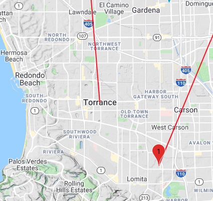

# Tracker App

## Developer: Mark Stuebs
Tracker App consists of a REACT front end using Axios request to get data through the Back End NodeJS/ExpressJS application from a Sequelize dB.

---

## Tracker App Links
1. [Tracker Front End App](https://tracker-app-front-end.herokuapp.com/)
   1. [FE Git Hub](https://github.com/MarkStuebs/front-end-p4)

1. [Tracker Back End App](https://tracker-backend-app.herokuapp.com/)

---

## User Stories
My user stories are documented here: [Link](./planning/userstories.md)

---

## Key Project Technologies

This app leverages many technologies on the front end and back end.  Details can be found here:  [Link](./Planning/Technologies.md)

---
 ## Google Javascript MAP API
 I created a seperate document detailing my path through the [Google API](./Planning/GoogleAPI.md) and some of the functionality that I played with but didn't make it into the final version of the SEI project release.

---

## Tracker App Planning and Wireframes
The following images were used as a guide for the desired user layout.
1. My Planning Folder contains project assets here: [Link](./planning)
1. Home Page Layout
   1. 
1. Header and Footer Layout
   1. 
1. [dB Table Plan drawinf](./Planning/db_Table_plan.pdf)
1. [Google API plan drawing](./Planning/Google_API_plan.pdf)
1. [Bootstrap plan drawing](./Planning/Bootstrap.pdf)

   

## Back End DataBase
PGAdmin was used to manage the back end.  Sequelize to create/drop tables, migrate them and seed them with initial starting data

### Supported Routes
1. /vehicle/info - GET, PUT and POST
1. /vehicle/info/all - GET
1. /vehicle/location/ - GET, PUT and POST
1. /vehicle/location/all - GET

---

## Opportunities
The following were de-scoped from the Tracker App due to time constraints and wanting to tread carefully to demo a limited functionality, but working MVP. 

1. I implemented breadcrumb functionality using polylines from the Google API. The code component is included in the git hub for future reference.

1. I do not have any Update and Create pages to support the back end functionality.

1.  I have a timer ("tic, toc") running every three seconds, an arbitrary time chosed soley for development purposes. Currnetly this outputs only to the console log, but could be hooked up to periodically refresh the FE state to provide live updates.

1.  Showing the whole fleet at one time on the map with the ability to selecta  marker and have the details page fill in

---

## Project 4 Instructions and Evaluation

The Capstone project 4 directions and evaluation criteria may be found in this section.  This covers both the Back End and Front End requirements and the way in which success will be determined and how garding will take place.

1. [SEI Instructions](https://git.generalassemb.ly/john-deere-sei-7/project-4)

## Project Evaluation
### Requirements

1. __[X]__ The app is deployed fully deployed (both the front-end and the back-end).
1. __[]__ New repos with the students' project code are included in the submission.
1. __[X]__ Students include a planning/ directory that sufficiently demonstrates their team's planning process.
1. __[X]__ The repos have a README that adequately documents the project.
1. __[X]__ The commit history of your repos show a roughly equal number of commits from each group member

## Criteria
We will evaluate your project according to the following criteria:

1. __[X]__ __Code Quality:__ Is the code well formatted? Is the code easy to read and understand? Does the code follow best practices?
1. __[X]__ __Technical Requirements:__ How does the project stack up to the requirements for this project? Is the developer making use of the material we've covered in a way that makes sense?
1. __[X]__ __Creativity & Interface:__ Is the application easy to navigate? Does it work well in every major browser? Is it responsive? Does it incorporate modern UI Themes?
1. __[X]__ __Functionality:__ Does the application work without errors or bugs? Does it present a complete app, where every feature is fully implemented in a way that makes sense?
1. __[X]__ __Presentation:__ Is there adequate documentation? Is the repository well organized and free of clutter?

|Score|Description|
|-----|-----------|
|0|Incomplete|
|1|Progressing|
|2|Performing|
|3|Excelling|

---

